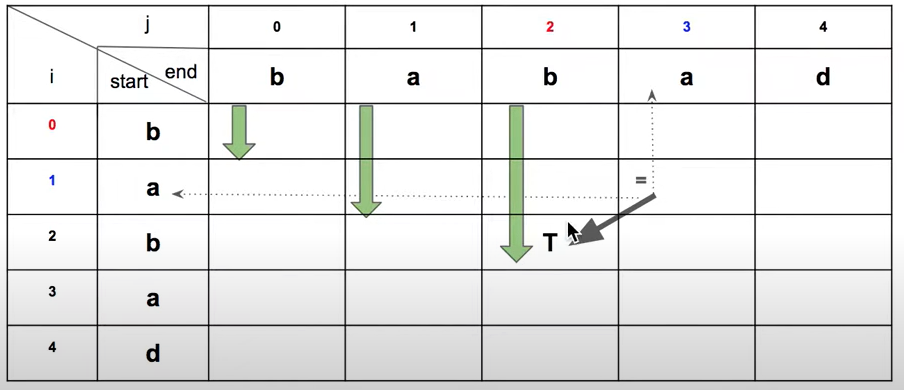
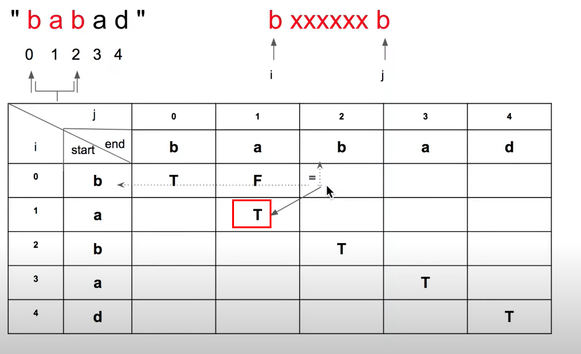

## Longest Palindromic Substring ##
---
### 需求 ###
- 原文 
Given a string `s`, return _the longest palindromic substring_ in `s`.

- 中文翻譯 
給定一字串 `s`, 需回傳 s 字串中最長的回文子字串。

- Constraints
	-  1 <= s.length <= 1000
	-   `s` consist of only digits and English letters.

---
### 構思 ###
- 使用 dp 算法 (一種需參考歷史紀錄的感覺)
1. 迭代迴圈方式參考圖(一)
2. 在是回文的子字串對應的點標記 true，反之為false。
	- j - i < 2 且 i 元素 == j 元素的都是回文
	- 反之需判斷: i 元素 == j 元素 且 dp左下角的點是否為回文，如是則為true，反之false。
	- 同時更新res

---
### 算法複雜度 ###
- 時間複雜度 : O(n^2)
- 空間複雜度 : O(n)

---
### 題目分類 ###
- String
- Dynamic Programming

---
### 圖片 ###
- 圖(一)

- 圖(二)

---
